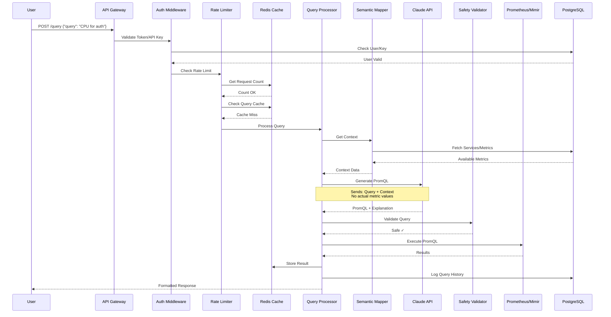
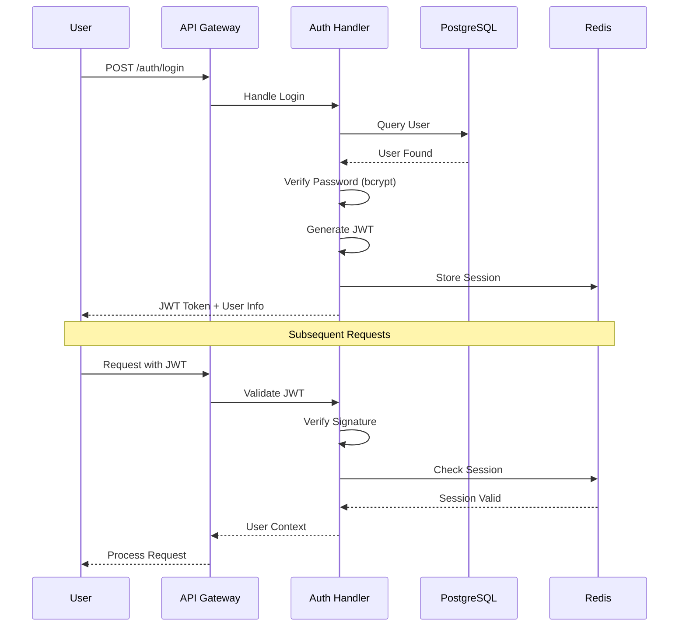
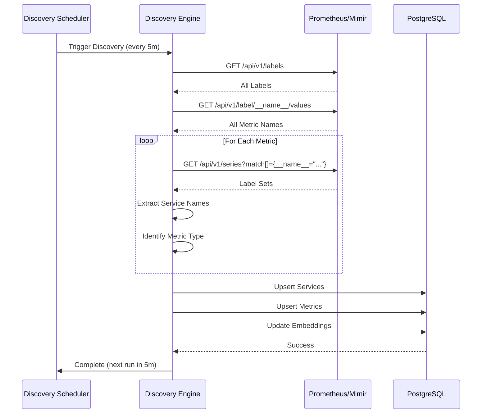

# Architecture Documentation

This document provides a detailed view of Observability AI's system architecture, request flow, and key components.

---

## Table of Contents

- [High-Level Architecture](#high-level-architecture)
- [Request Flow](#request-flow)
- [Component Details](#component-details)
- [Database Schema](#database-schema)
- [Authentication Flow](#authentication-flow)
- [Service Discovery](#service-discovery)
- [Deployment Architecture](#deployment-architecture)

---

## High-Level Architecture

```
┌─────────────────────────────────────────────────────────────────┐
│                         User/Client                             │
│          (Web UI, CLI, API Client, curl, etc.)                  │
└────────────┬────────────────────────────────────────────────────┘
             │
             │ HTTP/HTTPS Requests
             │
             ▼
┌─────────────────────────────────────────────────────────────────┐
│                      API Gateway Layer                          │
│                     (Gin Web Framework)                         │
│                                                                 │
│  ┌──────────────┐  ┌───────────────┐  ┌──────────────┐          │
│  │ Auth         │  │ Rate Limiter  │  │  CORS        │          │
│  │ Middleware   │  │  Middleware   │  │  Middleware  │          │
│  └──────────────┘  └───────────────┘  └──────────────┘          │
└────────────┬────────────────────────────────────────────────────┘
             │
             │
             ▼
┌─────────────────────────────────────────────────────────────────┐
│                     Core Application Layer                      │
│                                                                 │
│  ┌────────────────────────────────────────────────────────┐     │
│  │              Query Processor Engine                    │     │
│  │                                                        │     │
│  │  ┌──────────────┐  ┌───────────────┐  ┌────────────┐   │     │
│  │  │ Input        │  │ Semantic      │  │ Safety     │   │     │
│  │  │ Validation   │  │ Mapper        │  │ Validator  │   │     │
│  │  └──────────────┘  └───────────────┘  └────────────┘   │     │
│  │                                                        │     │
│  │  ┌──────────────┐  ┌───────────────┐  ┌────────────┐   │     │
│  │  │ PromQL       │  │ Result        │  │ Cache      │   │     │
│  │  │ Generator    │  │ Formatter     │  │ Manager    │   │     │
│  │  └──────────────┘  └───────────────┘  └────────────┘   │     │
│  └────────────────────────────────────────────────────────┘     │
│                                                                 │
│  ┌────────────────────────────────────────────────────────┐     │
│  │           Authentication & Authorization               │     │ 
│  │  • JWT Token Management                                │     │
│  │  • API Key Validation                                  │     │
│  │  • Role-Based Access Control (RBAC)                    │     │
│  └────────────────────────────────────────────────────────┘     │
│                                                                 │
│  ┌────────────────────────────────────────────────────────┐     │
│  │              Service Discovery Engine                  │     │
│  │  • Periodic Metric Discovery                           │     │
│  │  • Service Extraction                                  │     │
│  │  • Label Pattern Recognition                           │     │
│  └────────────────────────────────────────────────────────┘     │
└─────────┬──────────────────┬──────────────────┬──────────────── ┘
          │                  │                  │
          │                  │                  │
          ▼                  ▼                  ▼
┌──────────────────┐ ┌──────────────┐ ┌─────────────────┐
│   PostgreSQL     │ │    Redis     │ │   Claude API    │
│  (with pgvector) │ │              │ │  (Anthropic)    │
│                  │ │              │ │                 │
│ • Users          │ │ • Cache      │ │ • Query         │
│ • API Keys       │ │ • Sessions   │ │   Analysis      │
│ • Services       │ │ • Rate Limit │ │ • PromQL        │
│ • Metrics        │ │ • Job Queue  │ │   Generation    │
│ • Query History  │ │              │ │                 │
│ • Embeddings     │ │              │ │                 │
└──────────────────┘ └──────────────┘ └─────────────────┘
                                              │
                                              │ Returns PromQL
                                              ▼
                                      ┌─────────────────┐
                                      │  Prometheus/    │
                                      │     Mimir       │
                                      │                 │
                                      │ • Execute Query │
                                      │ • Return Data   │
                                      └─────────────────┘
```

---

## Request Flow

### 1. Natural Language Query Request

```
User → API Gateway → Auth Middleware → Rate Limiter → Query Processor
```

**Detailed Steps:**



---

### 2. Authentication Request Flow



---

### 3. Service Discovery Flow



---

## Component Details

### 1. API Gateway Layer (Gin Framework)

**Responsibilities:**
- HTTP request routing
- Middleware chain execution
- Request/response marshaling
- Error handling

**Key Routes:**
```go
// Public
GET  /health
GET  /api/v1/health
POST /auth/register
POST /auth/login

// Authenticated
POST /query
GET  /history
GET  /services
GET  /metrics

// Admin Only
GET    /admin/api-keys
POST   /admin/api-keys
PUT    /admin/api-keys/:id
DELETE /admin/api-keys/:id
GET    /admin/users/:id/usage
POST   /admin/discovery/trigger
```

**Middleware Stack:**
```
Request → CORS → Recovery → Logger → Auth → Rate Limiter → Handler
```

---

### 2. Query Processor Engine

**File:** [internal/processor/](../internal/processor/)

**Components:**

#### Input Validation
- Sanitizes user input
- Checks query length limits
- Filters malicious patterns

#### Semantic Mapper
- Fetches available services from DB
- Fetches available metrics from DB
- Builds context for Claude API
- Uses pgvector for similarity search

#### Safety Validator
- Validates generated PromQL syntax
- Checks for dangerous operations
- Ensures no data modification queries
- Rate-limits query complexity

#### PromQL Generator (Claude Integration)
- Sends context + query to Claude
- Receives PromQL + explanation
- Handles API errors/retries
- Manages token usage

#### Cache Manager
- Checks Redis for cached results
- Stores successful queries
- TTL-based expiration
- Query normalization for cache keys

---

### 3. Authentication & Authorization

**File:** [internal/auth/](../internal/auth/)

**Features:**

#### JWT Tokens
```go
type Claims struct {
    UserID   string   `json:"user_id"`
    Username string   `json:"username"`
    Roles    []string `json:"roles"`
    jwt.StandardClaims
}
```

- HS256 signing algorithm
- Configurable expiration (default: 24h)
- Refresh token support

#### API Keys
- Prefixed format: `obs_ai_...`
- SHA-256 hashed storage
- Per-key rate limits
- Expiration dates
- Revocation support

#### Roles
- `user`: Query access only
- `admin`: Full system access

---

### 4. Rate Limiting

**Implementation:** Redis-based sliding window

**Tiers:**
- Anonymous: Disabled (must authenticate)
- User: 100 requests/hour
- Admin: 1000 requests/hour
- API Key: Configurable per key

**Headers:**
```
X-RateLimit-Limit: 100
X-RateLimit-Remaining: 95
X-RateLimit-Reset: 1704124800
```

---

### 5. Service Discovery Engine

**File:** [internal/discovery/](../internal/discovery/) (if exists, or part of processor)

**Discovery Process:**

1. **Label Discovery**
   - Queries Prometheus `/api/v1/labels`
   - Identifies service label patterns: `service`, `job`, `app`, `application`

2. **Metric Discovery**
   - Queries `/api/v1/label/__name__/values`
   - Fetches all available metric names

3. **Service Extraction**
   - For each metric, queries series
   - Extracts unique service names from labels
   - Builds service → metrics mapping

4. **Database Update**
   - Upserts services table
   - Upserts metrics table
   - Updates semantic embeddings (pgvector)

**Scheduling:**
- Runs on startup
- Repeats every 5 minutes (configurable)
- Can be triggered manually via admin API

---

## Database Schema

### Users Table
```sql
CREATE TABLE users (
    id UUID PRIMARY KEY DEFAULT gen_random_uuid(),
    username VARCHAR(255) UNIQUE NOT NULL,
    email VARCHAR(255) UNIQUE NOT NULL,
    password_hash VARCHAR(255) NOT NULL,
    roles TEXT[] NOT NULL DEFAULT ARRAY['user'],
    created_at TIMESTAMP DEFAULT NOW(),
    updated_at TIMESTAMP DEFAULT NOW()
);
```

### API Keys Table
```sql
CREATE TABLE api_keys (
    id UUID PRIMARY KEY DEFAULT gen_random_uuid(),
    user_id UUID REFERENCES users(id) ON DELETE CASCADE,
    name VARCHAR(255) NOT NULL,
    key_hash VARCHAR(255) UNIQUE NOT NULL,
    prefix VARCHAR(20) NOT NULL,
    description TEXT,
    rate_limit INTEGER DEFAULT 100,
    expires_at TIMESTAMP,
    last_used_at TIMESTAMP,
    created_at TIMESTAMP DEFAULT NOW(),
    revoked_at TIMESTAMP
);
```

### Services Table
```sql
CREATE TABLE services (
    id UUID PRIMARY KEY DEFAULT gen_random_uuid(),
    name VARCHAR(255) UNIQUE NOT NULL,
    namespace VARCHAR(255),
    description TEXT,
    labels JSONB,
    discovered_at TIMESTAMP DEFAULT NOW(),
    last_seen_at TIMESTAMP DEFAULT NOW()
);
```

### Metrics Table
```sql
CREATE TABLE metrics (
    id UUID PRIMARY KEY DEFAULT gen_random_uuid(),
    name VARCHAR(255) UNIQUE NOT NULL,
    metric_type VARCHAR(50), -- counter, gauge, histogram, summary
    description TEXT,
    labels JSONB,
    services UUID[] REFERENCES services(id),
    discovered_at TIMESTAMP DEFAULT NOW(),
    last_seen_at TIMESTAMP DEFAULT NOW()
);
```

### Query History Table
```sql
CREATE TABLE query_history (
    id UUID PRIMARY KEY DEFAULT gen_random_uuid(),
    user_id UUID REFERENCES users(id) ON DELETE CASCADE,
    natural_language_query TEXT NOT NULL,
    generated_promql TEXT NOT NULL,
    execution_time_ms INTEGER,
    success BOOLEAN NOT NULL,
    error_message TEXT,
    cached BOOLEAN DEFAULT FALSE,
    created_at TIMESTAMP DEFAULT NOW()
);
```

### Query Embeddings Table (pgvector)
```sql
CREATE TABLE query_embeddings (
    id UUID PRIMARY KEY DEFAULT gen_random_uuid(),
    query_text TEXT NOT NULL,
    embedding VECTOR(768), -- pgvector extension
    promql TEXT NOT NULL,
    usage_count INTEGER DEFAULT 1,
    last_used_at TIMESTAMP DEFAULT NOW(),
    created_at TIMESTAMP DEFAULT NOW()
);

CREATE INDEX ON query_embeddings USING ivfflat (embedding vector_cosine_ops);
```

---

## Authentication Flow

### JWT Token Authentication

```
1. User logs in with username/password
2. Backend verifies credentials
3. Backend generates JWT with claims:
   - user_id, username, roles
   - Expiration: 24 hours
4. User includes JWT in Authorization header:
   Authorization: Bearer <token>
5. Auth middleware validates:
   - Signature verification
   - Expiration check
   - Session validation (Redis)
6. Request proceeds with user context
```

### API Key Authentication

```
1. Admin creates API key via /admin/api-keys
2. System generates key with prefix obs_ai_
3. Backend stores SHA-256 hash
4. User includes key in header:
   X-API-Key: obs_ai_1234567890abcdef
5. Auth middleware validates:
   - Key exists and not revoked
   - Not expired
   - Rate limit not exceeded
6. Request proceeds with key context
```

---

## Service Discovery

### Why Service Discovery?

**Problem:** Manually maintaining service and metric lists is tedious and error-prone.

**Solution:** Automatically discover from Prometheus/Mimir.

### Discovery Schedule

```
App Startup → Immediate Discovery
     ↓
Every 5 minutes → Scheduled Discovery
     ↓
Manual Trigger (admin API) → On-Demand Discovery
```

### What Gets Discovered

1. **Services**
   - Names from labels: `service`, `job`, `app`, `application`
   - Namespaces (if available)
   - Associated metrics

2. **Metrics**
   - All metric names from `__name__` label
   - Metric types (inferred from naming conventions)
   - Label sets
   - Which services use which metrics

3. **Relationships**
   - Service → Metrics mapping
   - Metric → Services mapping
   - Common label patterns

---

## Deployment Architecture

### Docker Compose (Development)

```
┌─────────────────────────────────────────────────────────┐
│                    Docker Host                          │
│                                                         │
│  ┌──────────────┐  ┌──────────────┐  ┌──────────────┐   │
│  │  PostgreSQL  │  │    Redis     │  │   Backend    │   │
│  │   :5432      │  │    :6379     │  │    :8080     │   │
│  └──────────────┘  └──────────────┘  └──────────────┘   │
│                                                         │
│  ┌──────────────────────────────────────────────────┐   │
│  │           Frontend (Optional)                    │   │
│  │                :3000                             │   │
│  └──────────────────────────────────────────────────┘   │
└─────────────────────────────────────────────────────────┘
         │                    │                 │
         └────────────────────┴─────────────────┘
                              │
                    User Access via localhost
```

### Kubernetes (Production)

```
┌─────────────────────────────────────────────────────────────┐
│                    Kubernetes Cluster                       │
│                                                             │
│  ┌─────────────────────────────────────────────────────┐    │
│  │              Ingress Controller                     │    │
│  │         (nginx / traefik / istio)                   │    │
│  └────────────────┬────────────────────────────────────┘    │
│                   │                                         │
│  ┌────────────────▼────────────────────────────────────┐    │
│  │           Backend Service (LoadBalancer)            │    │
│  └────────────────┬────────────────────────────────────┘    │
│                   │                                         │
│  ┌────────────────▼────────────────────────────────────┐    │
│  │      Backend Deployment (3 replicas)                │    │
│  │  ┌──────────┐  ┌──────────┐  ┌──────────┐           │    │
│  │  │  Pod 1   │  │  Pod 2   │  │  Pod 3   │           │    │
│  │  └──────────┘  └──────────┘  └──────────┘           │    │
│  └─────────────────────────────────────────────────────┘    │
│                                                             │
│  ┌──────────────────────┐  ┌──────────────────────┐         │
│  │  Postgre StatefulSet │  │  Redis Deployment    │         │
│  │    (with PVC)        │  │                      │         │
│  └──────────────────────┘  └──────────────────────┘         │
└─────────────────────────────────────────────────────────────┘
         │
         │ External Access
         ▼
    ┌─────────────────────┐
    │  Prometheus/Mimir   │
    │  (External or Same  │
    │     Cluster)        │
    └─────────────────────┘
```

---

## Technology Choices

### Core Services
- **Language**: Go (for performance, concurrency, and Kubernetes ecosystem fit)
- **Database**: PostgreSQL (for semantic mappings, query history, user sessions)
- **Cache**: Redis (for query results, semantic embeddings)
- **Message Queue**: Redis (for async query processing)

### AI/ML Components
- **Embedding Model**: OpenAI text-embedding-3-small or sentence-transformers
- **LLM**: OpenAI GPT-4 or Claude (configurable)
- **Vector Database**: pgvector (PostgreSQL extension) for semantic search

### Why Go?
- Fast compilation and execution
- Excellent concurrency (goroutines)
- Small binary size
- Easy deployment (single binary)
- Strong HTTP libraries (Gin)

### Why PostgreSQL with pgvector?
- Reliable ACID guarantees
- pgvector for semantic search
- Mature ecosystem
- JSON support (JSONB)
- Good performance

### Why Redis?
- Fast in-memory cache
- Session storage
- Rate limiting (atomic operations)
- Pub/sub for future features

### Why Claude?
- Superior technical accuracy
- Better context handling
- Safer outputs (fewer hallucinations)
- Excellent at PromQL generation

---

## Performance Considerations

### Query Response Time Breakdown

Typical query processing time:
```
Component              Time (ms)    % of Total
─────────────────────────────────────────────
Authentication         5-10         2-3%
Cache Lookup           1-2          <1%
Semantic Context       10-20        3-5%
Claude API Call        200-500      60-80%
PromQL Validation      5-10         2-3%
Prometheus Query       50-150       15-25%
Result Formatting      5-10         2-3%
─────────────────────────────────────────────
Total (Cache Miss)     276-702 ms
Total (Cache Hit)      76-202 ms    (70% faster)
```

### Optimization Strategies

1. **Caching**
   - Cache identical queries
   - Cache semantic context
   - TTL: 5 minutes (configurable)

2. **Connection Pooling**
   - PostgreSQL connection pool
   - Redis connection pool
   - HTTP client reuse

3. **Async Operations**
   - Service discovery runs in background
   - Query history logged asynchronously
   - Metrics collection non-blocking

4. **Rate Limiting**
   - Prevents system overload
   - Protects Claude API quota
   - Fair resource allocation

---

## Security Architecture

### Defense in Depth

```
Layer 1: Network (HTTPS/TLS)
   ↓
Layer 2: Authentication (JWT/API Keys)
   ↓
Layer 3: Authorization (RBAC)
   ↓
Layer 4: Rate Limiting
   ↓
Layer 5: Query Validation
   ↓
Layer 6: Safe Execution
```

### Security Features

- **Encrypted Storage**: Passwords (bcrypt), API keys (SHA-256)
- **Token Expiration**: JWTs expire after 24h
- **API Key Revocation**: Instant key deactivation
- **Query Validation**: Blocks dangerous PromQL
- **Rate Limiting**: Prevents abuse
- **Audit Logging**: All queries logged
- **CORS Protection**: Configurable origins
- **SQL Injection Protection**: Parameterized queries

---

## Monitoring & Observability

### Application Metrics

The application exposes metrics about itself:

```promql
# Request metrics
http_requests_total{endpoint="/query"}
http_request_duration_seconds{endpoint="/query"}

# Query processing metrics
query_processing_duration_seconds
query_cache_hits_total
query_cache_misses_total

# Claude API metrics
claude_api_requests_total
claude_api_errors_total
claude_api_token_usage

# Authentication metrics
auth_attempts_total{result="success|failure"}
api_key_validations_total

# Rate limit metrics
rate_limit_exceeded_total
```

### Health Checks

```
GET /health → Overall health
GET /api/v1/health → Detailed component health
```

Response:
```json
{
  "status": "healthy",
  "components": {
    "database": "healthy",
    "redis": "healthy",
    "claude_api": "healthy",
    "prometheus": "healthy"
  },
  "timestamp": "2025-01-15T10:00:00Z"
}
```

---

## Further Reading

- **[Configuration Reference](CONFIGURATION.md)** - Environment variables
- **[API Documentation](API.md)** - API endpoints
- **[Deployment Guide](DEPLOYMENT.md)** - Production deployment
- **[Query Examples](QUERY_EXAMPLES.md)** - Usage examples

---

**Questions?** Open an issue on [GitHub](https://github.com/seanankenbruck/observability-ai/issues)
